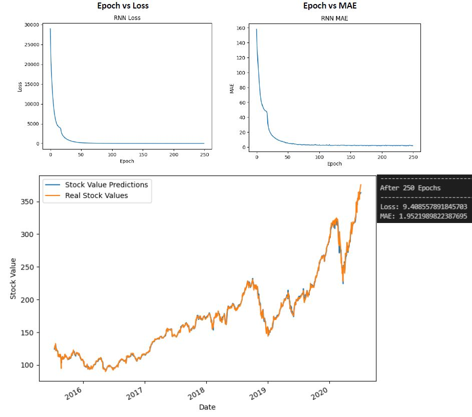
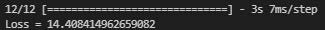
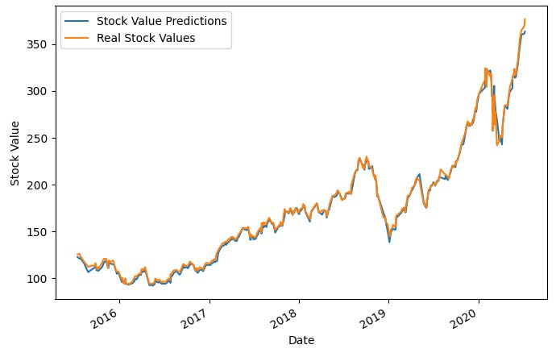
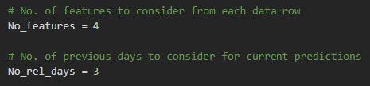

<!-- Reference:
https://github.com/othneildrew/Best-README-Template -->

<!-- PROJECT LOGO -->
 

  <h1 align="center"><i> Stock Market Prediction using RNN </i></h1>

  
  
  

    Three Recurrent Neural Networks (RNNs) to predict continuous future output using a time-based series of inputs.
  

 

<!-- TABLE OF CONTENTS -->

  
Table of Contents

  <ol>
    <li><a href="#about-the-project">About The Project</a></li>
    <li><a href="#built-with">Built With</a></li>
    <li><a href="#getting-started">Getting Started</a></li>
    <li><a href="#case-study-analysis">Case Study Analysis</a></li>
    <li><a href="#license-or-author">License or Author</a></li>
    <li><a href="#contact">Contact</a></li>
    <li><a href="#acknowledgments">Acknowledgments</a></li>
  </ol>

 

<!-- ABOUT THE PROJECT -->
## About The Project
  In this project, we make use of TensorFlow's keras library to create a 3 Recurrent Neural Networks - namely Simple, LSTM (Long Short Term Memory) and GRU (Gated Recurrent Unit); that can effectively predict future values using data from the past, and also takes the sequence into consideration.

  For case study analysis, we use stock market data of a company from all days of the year, in sequence. And try to predict the current day's stock using the value from previous 3 days. The results and discussions of the analysis can be found in one of the below sections.

  
(<a href="#readme-top">back to top</a>)

## Built With
  &nbsp; &nbsp; &nbsp; &nbsp;  &nbsp; &nbsp; &nbsp; &nbsp; &nbsp; &nbsp; &nbsp; &nbsp;  &nbsp; &nbsp;

  &nbsp; &nbsp; &nbsp; &nbsp; <b><i> Python</i></b> &nbsp; &nbsp; &nbsp; &nbsp; &nbsp; <b><i> TensorFlow </i></b>

  
(<a href="#readme-top">back to top</a>)

<!-- GETTING STARTED -->
## Getting Started
  #### Prerequisites
  * Python
  * TensorFlow
  * Numpy
  * Pandas
  * sklearn
  * pickle
  * glob

  #### Installation & Use
  1. Get <b>train_rnn.py</b> and <b>utils.py</b>
  2. Import <b>RNN</b> in your implementation
  3. Use the functions as per your convinience and configuration.

  
(<a href="#readme-top">back to top</a>)

<!-- USAGE EXAMPLES -->
## Case Study Analysis
  We use dataset from 'Data/q2_dataset.csv' which contains the stock price of the company for each day of the year in sequence. We then use it to create a train and test set utlizing data from only 3 consecutive days to predict the fourth days stock.

  * #### Prepare Dataset:
    1. The provided csv file was read using ‘pandas’ library
    2. 3 sets of data were created for:
       * <b>Input Data:</b> which contained (Open, High, Low, Volume) parameters from last 3 days. Hence each input row now contained 12 input parameters, each.
       * <b>Labels:</b> which contained the expected ‘Open’ values for the corresponding days.
       * <b>Dates:</b> which contained the dates for the corresponding days. (Later used for plotting the graphs)
    3. The 3 sets were divided into training and testing sets (70% and 30% respectively)
    4. All 3 training sets were concatenated & saved in ‘./data/train_data_RNN.csv’
    5. All 3 testing sets were concatenated & saved in ‘./data/test_data_RNN.csv’

  <spacer type="vertical" height="4" width="2"></spacer>
  
  * #### Pre-processing Steps:
    1. The input values were scaled to a range of (0, 1).
       - i.e.: each of the input values ware mapped to a corresponding value ranging from 0 to 1
    2. The input was then reshaped to adhere to the following format for the RNN:
       * Format: [Samples, Timesteps, Features]
       * In our case:
       
         a. ‘Samples’ = Total number of records/inputs
         
         b ‘Timesteps’ = Number of previous days (3) being considered
         
         c. ‘Features’ = Number of features (4) being used from each day

  * #### How Final Design was chosen ?
    1. First, different types of Recurrent Neural Networks were considered:
       (Implementation for first 2 has been commented in the code. One can easily try them out, if needed.)
        * <b>Simple RNN:</b> found to be the fastest of the lot (when it comes to training)
        * <b>GRU (Gated Recurrent Units):</b> Results were similar to LSTM, but LSTM produced slightly better results.
        * <b>LSTM (Long Short-Term Memory):</b> Achieved minimum loss for Test Predictions, although was the slowest.
      .
    2. We tried a number of configurations – including single layer & multi-layered (2-5) – with varying units in the range of [32, 64, 128, 256]. Eventually we found 3 consecutive LSTM layers – each with 64, 128, and 256 units respectively, to provide very efficient results.

    3. We decided to utilize LSTM, since it achieved best results in terms of loss.
    .

  * #### Final Network Architecture:
    1. <b>Final Design:</b>
       * <b>Input:</b> 3 timesteps – with 4 features each
       * <b>LSTM-Layer-1:</b> with 64 Units, with default activations (‘relu’ – activation, ‘sigmoid’ – recurrent activation)
       * <b>LSTM-Layer-2:</b> with 128 Units, with default activations
       * <b>LSTM-Layer-3:</b> with 256 Units, with default activations
       * <b>Dense-Layer:</b> With only 1 neuron and no explicit activation; acting as the final output layer

        This is not a classification problem. Hence, we decided not to use any explicit activation at the output layer.
        We had also tried adding Dropout layers, but they were no help in improving the results.
      
    2. <b>Number of Epochs = 250:</b> Having tried different values, it was observed that the loss values were fluctuating very closely post epoch = 200. We took this as an indication of possible convergence & decided to restrict the epochs.
    3. <b>Loss Function = Mean Square Error:</b> This was one of the most popular options available to accurately measure the loss; and it suited our needs, as the problem does not involve classification.
    4. <b>Batch Size</b> = 16
    5. <b>Optimizer = ‘Adam’</b>, with default initial learning rate

  * #### Output of Training Loop
    
    
    * After training for 250 epochs, the latest ‘Loss’ value (MSE - Mean square error) was ~9.4085, which is very less, specially compared to the initial loss of over 25000. And the MAE (Mean Absolute Error) which was used as a metric as well, was also down to ~1.95.
    
    * As we can see in the graph, the loss decreases drastically during the initial epochs and then improves in smaller chunks as it is nearing convergence; as is expected.
    
    * The Date v/s Stock Value graph shows how the network is able to predict for the training data (at the end of training), which is consistent with the low loss value and backs our decision to stop at epochs=250, as it appears to be converging well.

  <spacer type="vertical" height="4" width="2"></spacer>

  * #### Testing Output
    
    
    * On testing the network with the remaining 30% input data, which the network was not exposed to; we were able to achieve good results with a total loss = ~ 14.40.
    * Below is the plot showing the difference (in values), between the predicted stocks and the actual stocks that were expected.

    

    * As we can see, some stocks appear to have been predicted very well.
    
    * We can also observe some other stocks which were not predicted as accurately, but still are very close to the actual values.
    
    * The above graph is reflective of the low loss and appears to provide efficient results.

  * #### Experiment with more days for features:
    * We tried with 6 days instead of 3.
    * And observed a higher loss value (~ 19) for the test set.
    * One can easily try this option by simply changing the value of ‘No_rel_days’ to 6 in both – training as well as testing files.
 
      

  
(<a href="#readme-top">back to top</a>)

<!-- LICENSE -->
## License or Author
  * Authored by: Uditya Laad, Himalaya Sharma, Dakota Wang - University of Waterloo
  * <b> Case Study</b> : Suggested By Prof. Hatham Amar - University of Waterloo

  
(<a href="#readme-top">back to top</a>)

<!-- CONTACT -->
## Contact
  <b>Uditya Laad</b> &nbsp; [@linkedin.com/in/uditya-laad-222680148](https://www.linkedin.com/in/uditya-laad-222680148/)
  
  &nbsp; &nbsp; &nbsp; &nbsp; &nbsp; &nbsp; &nbsp; &nbsp; &nbsp; &nbsp; &nbsp; [@github.com/udityalaad](https://github.com/udityalaad)
  
  &nbsp; &nbsp; &nbsp; &nbsp; &nbsp; &nbsp; &nbsp; &nbsp; &nbsp; &nbsp; &nbsp; udityalaad123@gmail.com

  <b>Project Link</b> &nbsp; [https://github.com/udityalaad/Stock_Market_Prediction_Using_RNN](https://github.com/udityalaad/Stock_Market_Prediction_Using_RNN)

  
(<a href="#readme-top">back to top</a>)

<!-- ACKNOWLEDGMENTS -->
## Acknowledgments
  * ECE 657, Assignment 3, Hatham Amar, University of Waterloo, Waterloo, ON, CA
  * [github.com/othneildrew/Best-README-Template/](https://github.com/othneildrew/Best-README-Template)
  * [TensorFlow](https://www.tensorflow.org/)
  * [https://www.tensorflow.org/guide/keras/rnn](https://www.tensorflow.org/guide/keras/rnn)
  * [https://www.tensorflow.org/api_docs/python/tf/keras/layers/LSTM](https://www.tensorflow.org/api_docs/python/tf/keras/layers/LSTM)
  * [https://www.tensorflow.org/api_docs/python/tf/keras/layers/SimpleRNN](https://www.tensorflow.org/api_docs/python/tf/keras/layers/SimpleRNN)
  * [https://www.tensorflow.org/api_docs/python/tf/keras/layers/GRU](https://www.tensorflow.org/api_docs/python/tf/keras/layers/GRU)
  * [RNN Simplified- A beginner’s guide, Arpan Das, Towards Data Science](https://towardsdatascience.com/rnn-simplified-a-beginners-guide-cf3ae1a8895b)

  
(<a href="#readme-top">back to top</a>)

